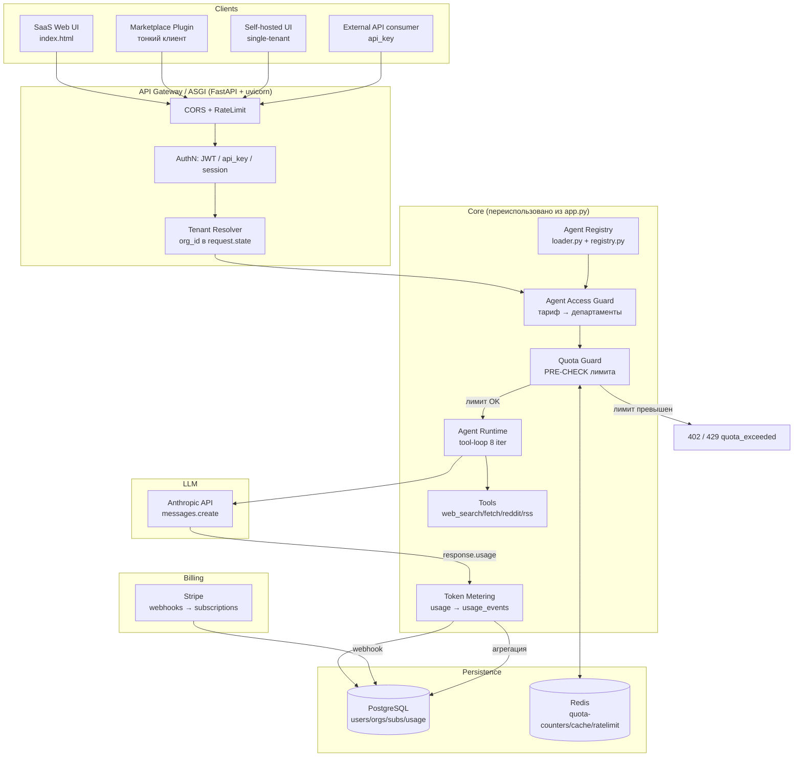
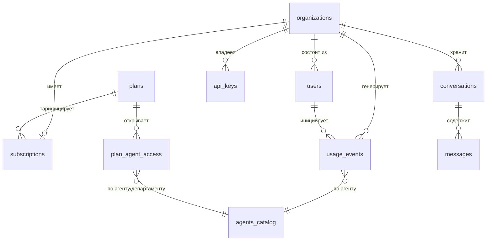

# 02 — Backend Architecture: Общее ядро AI-агентства (SaaS / Marketplace-плагин / Self-hosted)

> Автор: Backend Architect (NEXUS)
> Базис: реальный прототип `C:\Users\User\Desktop\projects\marketing-office\app.py` (550 строк, Flask 3 + Anthropic SDK напрямую).
> Принцип: **одна кодовая база → три продукта** через конфиг-флаги. Минимум переписывания, максимум переиспользования.

---

## 0. TL;DR

- **Стек**: FastAPI (async) + AsyncAnthropic, SQLAlchemy 2 (async) + Alembic, PostgreSQL 15 (RLS, JSONB), Redis (квоты/rate-limit/кеш), arq для фона, Stripe для биллинга, JWT+argon2+api_key для auth. ~70% прототипа (агенты, инструменты, tool-loop) переезжает почти без изменений; переписывается только тонкий HTTP-слой.
- **Ключевые таблицы**: `organizations` (tenant root), `users`, `plans` + `plan_agent_access` (тариф→департаменты), `subscriptions` (Stripe), `api_keys` (plugin/external), и **`usage_events`** — ядро монетизации (input/output/cache/server-tool токены + `billable_tokens`).
- **Token-metering**: перехват `response.usage` встроен **внутрь** runtime-цикла (а не разово в конце, как ошибочно в app.py:537), аккумулируется по всем ≤8 итерациям → один идемпотентный INSERT в `usage_events`. Квота проверяется **ПЕРЕД** каждым вызовом Anthropic через Redis-счётчик с БД-сверкой; при превышении — `402 quota_exceeded` до обращения к LLM.
- **Одна база → 3 продукта**: режим задаёт `DEPLOY_MODE` (saas/selfhosted/plugin); multi-tenancy, Stripe и quota-block включаются флагами. Self-hosted = single-tenant с одной org и безлимитом, но metering остаётся. Плагин = тонкий клиент к нашему API по `api_key`.
- **Главный риск**: недосчёт токенов в прототипе (app.py учитывает только последнюю итерацию tool-loop) — дыра в монетизации, закрывается шагом 4 (§4.2).
- **Срок**: ~8.5 рабочих дней до прод-ядра с монетизацией, инкрементально (прототип жив до шага 4).

---

## 1. Целевая архитектура ядра

### 1.1. Что есть в прототипе (app.py) и судьба каждого блока

| Блок прототипа | Строки | Решение | Куда переезжает |
|---|---|---|---|
| `parse_agent_file` / `load_agents` (frontmatter + body) | 37–73 | **Переиспользуем 1:1** | `core/agents/loader.py` |
| Загрузка из `agents/*.md` глобально при старте | 61–73 | **Меняем**: ленивая загрузка + кеш + источник = `agency_agents/` | `core/agents/registry.py` |
| Tool-функции (`tool_search_reddit`, `tool_fetch_url`, RSS, news) | 92–292 | **Переиспользуем 1:1** | `core/tools/*.py` |
| SSRF-защита `_is_safe_url` | 231–251 | **Переиспользуем, усиливаем** (DNS-rebind, redirect-check) | `core/tools/safety.py` |
| `TOOL_DEFS` / `build_tools_for_agent` | 294–410 | **Переиспользуем** | `core/tools/registry.py` |
| Agent-runtime цикл (до 8 итераций, tool_use loop) | 476–536 | **Выносим в сервис** + добавляем metering hook | `core/runtime/agent_runtime.py` |
| Перехват `resp.usage` | 537–541 | **КРИТИЧНО расширяем**: пишем в БД на каждой итерации | `core/billing/metering.py` |
| `GET /` (render index.html) | 418–420 | Остаётся для SaaS UI, отключается в plugin-режиме | `api/web.py` |
| `GET /api/agents` | 423–437 | **Меняем**: фильтр по `agent_access` тарифа | `api/routes/agents.py` |
| `POST /api/chat` | 440–546 | **Рефакторим**: auth → quota-check → runtime → metering | `api/routes/chat.py` |
| Глобальный `client = Anthropic()` | 30 | Остаётся, но ключ — per-tenant в self-hosted/BYOK | `core/llm/client.py` |
| Запуск `app.run(127.0.0.1:5000)` | 549–550 | Меняем на ASGI (uvicorn/gunicorn) | `main.py` |

**Вывод**: ~70% прототипа (агенты + инструменты + runtime-логика) переезжает почти без изменений. Переписываем только тонкий HTTP-слой и добавляем 4 новых среза: auth, tenancy, billing/metering, persistence.

### 1.2. Целевая схема (mermaid)



### 1.3. Ключевые архитектурные решения

1. **Quota-check ПЕРЕД запросом в Anthropic** (а не после) — иначе тенант может уйти в минус на дорогом запросе. Pre-check по Redis-счётчику (быстро), точная сверка — по `usage_events` в PG.
2. **Metering встроен в runtime-цикл**, а не только в финале. В прототипе usage берётся 1 раз из последнего `resp` (строки 537–541) — это **теряет токены промежуточных tool-итераций**. В проде суммируем usage на каждой из 8 итераций.
3. **Stateless core** — состояние сессии (история сообщений) хранит клиент или БД-таблица `conversations` (опционально), сам runtime без глобального state → горизонтальное масштабирование.
4. **Tenant Resolver как middleware** — `org_id` кладётся в `request.state` один раз, все нижележащие запросы к БД фильтруются по нему (Row-Level Security).

---

## 2. Схема БД (PostgreSQL)

### 2.1. ER-обзор



### 2.2. DDL (готов под Alembic `op.execute` или autogenerate из SQLAlchemy-моделей)

```sql
-- ========== EXTENSIONS ==========
CREATE EXTENSION IF NOT EXISTS "pgcrypto";   -- gen_random_uuid()

-- ========== ORGANIZATIONS (tenant root) ==========
-- В self-hosted режиме существует ровно одна строка (org_id = DEFAULT_ORG).
CREATE TABLE organizations (
    id            UUID PRIMARY KEY DEFAULT gen_random_uuid(),
    name          VARCHAR(255) NOT NULL,
    slug          VARCHAR(100) UNIQUE NOT NULL,
    byok_api_key  TEXT,                       -- зашифрованный Anthropic-ключ тенанта (BYOK), NULL = платформенный ключ
    created_at    TIMESTAMPTZ NOT NULL DEFAULT NOW(),
    updated_at    TIMESTAMPTZ NOT NULL DEFAULT NOW(),
    deleted_at    TIMESTAMPTZ
);

-- ========== USERS ==========
CREATE TABLE users (
    id             UUID PRIMARY KEY DEFAULT gen_random_uuid(),
    org_id         UUID NOT NULL REFERENCES organizations(id) ON DELETE CASCADE,
    email          CITEXT NOT NULL,           -- регистронезависимый
    password_hash  VARCHAR(255),              -- argon2id; NULL если только OAuth/magic-link
    full_name      VARCHAR(200),
    role           VARCHAR(20) NOT NULL DEFAULT 'member'  -- owner|admin|member
                   CHECK (role IN ('owner','admin','member')),
    oauth_provider VARCHAR(30),               -- google|github|NULL
    oauth_sub      VARCHAR(255),
    email_verified BOOLEAN NOT NULL DEFAULT FALSE,
    created_at     TIMESTAMPTZ NOT NULL DEFAULT NOW(),
    updated_at     TIMESTAMPTZ NOT NULL DEFAULT NOW(),
    deleted_at     TIMESTAMPTZ,
    UNIQUE (org_id, email)
);
CREATE UNIQUE INDEX idx_users_oauth ON users(oauth_provider, oauth_sub)
    WHERE oauth_provider IS NOT NULL;

-- ========== PLANS (каталог тарифов) ==========
CREATE TABLE plans (
    id                 UUID PRIMARY KEY DEFAULT gen_random_uuid(),
    code               VARCHAR(50) UNIQUE NOT NULL,   -- free|starter|pro|enterprise|selfhosted
    name               VARCHAR(100) NOT NULL,
    stripe_price_id    VARCHAR(100),
    monthly_token_quota BIGINT NOT NULL DEFAULT 0,    -- 0 = безлимит (enterprise/selfhosted)
    max_seats          INT NOT NULL DEFAULT 1,
    rate_limit_rpm     INT NOT NULL DEFAULT 20,       -- requests per minute
    price_cents        INT NOT NULL DEFAULT 0,
    is_active          BOOLEAN NOT NULL DEFAULT TRUE,
    created_at         TIMESTAMPTZ NOT NULL DEFAULT NOW()
);

-- ========== SUBSCRIPTIONS ==========
CREATE TABLE subscriptions (
    id                     UUID PRIMARY KEY DEFAULT gen_random_uuid(),
    org_id                 UUID NOT NULL REFERENCES organizations(id) ON DELETE CASCADE,
    plan_id                UUID NOT NULL REFERENCES plans(id),
    status                 VARCHAR(20) NOT NULL DEFAULT 'active'  -- active|past_due|canceled|trialing
                           CHECK (status IN ('active','past_due','canceled','trialing')),
    stripe_subscription_id VARCHAR(100),
    stripe_customer_id     VARCHAR(100),
    current_period_start   TIMESTAMPTZ NOT NULL DEFAULT NOW(),
    current_period_end     TIMESTAMPTZ NOT NULL,       -- граница окна квоты
    cancel_at_period_end   BOOLEAN NOT NULL DEFAULT FALSE,
    created_at             TIMESTAMPTZ NOT NULL DEFAULT NOW(),
    updated_at             TIMESTAMPTZ NOT NULL DEFAULT NOW()
);
CREATE UNIQUE INDEX idx_sub_active_org ON subscriptions(org_id)
    WHERE status IN ('active','trialing','past_due');

-- ========== AGENTS CATALOG (зеркало .md-файлов из agency_agents/) ==========
-- Заполняется синхронизацией из файловой системы; .md остаётся source of truth.
CREATE TABLE agents_catalog (
    id          VARCHAR(100) PRIMARY KEY,     -- = path.stem (как в app.py:51)
    name        VARCHAR(200) NOT NULL,
    department  VARCHAR(50) NOT NULL DEFAULT 'other',  -- = category из frontmatter
    emoji       VARCHAR(16),
    description  TEXT,
    is_active   BOOLEAN NOT NULL DEFAULT TRUE,
    synced_at   TIMESTAMPTZ NOT NULL DEFAULT NOW()
);

-- ========== PLAN ↔ AGENT ACCESS (что открыто на тарифе) ==========
-- Гранулярность: либо весь департамент, либо конкретный агент.
CREATE TABLE plan_agent_access (
    id          UUID PRIMARY KEY DEFAULT gen_random_uuid(),
    plan_id     UUID NOT NULL REFERENCES plans(id) ON DELETE CASCADE,
    department  VARCHAR(50),                  -- NULL если задан agent_id
    agent_id    VARCHAR(100) REFERENCES agents_catalog(id) ON DELETE CASCADE,
    CHECK (department IS NOT NULL OR agent_id IS NOT NULL)
);
CREATE INDEX idx_paa_plan ON plan_agent_access(plan_id);

-- ========== API KEYS (для plugin / external API) ==========
CREATE TABLE api_keys (
    id          UUID PRIMARY KEY DEFAULT gen_random_uuid(),
    org_id      UUID NOT NULL REFERENCES organizations(id) ON DELETE CASCADE,
    name        VARCHAR(100) NOT NULL,
    key_prefix  VARCHAR(12) NOT NULL,         -- "nx_live_xxx" — показываем юзеру
    key_hash    VARCHAR(255) NOT NULL,        -- sha256 полного ключа; сам ключ не храним
    scopes      TEXT[] NOT NULL DEFAULT '{}', -- ['chat','agents:read']
    last_used_at TIMESTAMPTZ,
    expires_at  TIMESTAMPTZ,
    revoked_at  TIMESTAMPTZ,
    created_at  TIMESTAMPTZ NOT NULL DEFAULT NOW()
);
CREATE UNIQUE INDEX idx_apikey_hash ON api_keys(key_hash) WHERE revoked_at IS NULL;
CREATE INDEX idx_apikey_org ON api_keys(org_id);

-- ========== USAGE EVENTS (ядро монетизации — каждый вызов Anthropic) ==========
CREATE TABLE usage_events (
    id                 BIGSERIAL PRIMARY KEY,
    org_id             UUID NOT NULL REFERENCES organizations(id) ON DELETE CASCADE,
    user_id            UUID REFERENCES users(id) ON DELETE SET NULL,
    api_key_id         UUID REFERENCES api_keys(id) ON DELETE SET NULL,
    agent_id           VARCHAR(100),
    model              VARCHAR(60) NOT NULL,
    input_tokens       INT NOT NULL DEFAULT 0,   -- response.usage.input_tokens
    output_tokens      INT NOT NULL DEFAULT 0,   -- response.usage.output_tokens
    cache_read_tokens  INT NOT NULL DEFAULT 0,   -- usage.cache_read_input_tokens
    cache_write_tokens INT NOT NULL DEFAULT 0,   -- usage.cache_creation_input_tokens
    server_tool_uses   INT NOT NULL DEFAULT 0,   -- web_search вызовы (биллятся отдельно)
    billable_tokens    INT NOT NULL DEFAULT 0,   -- нормализованная единица квоты (см. §4.4)
    cost_microcents    BIGINT NOT NULL DEFAULT 0,-- расчётная себестоимость
    request_id         VARCHAR(80),              -- идемпотентность
    created_at         TIMESTAMPTZ NOT NULL DEFAULT NOW()
);
-- Партиционирование по месяцу — usage_events растёт быстрее всех.
CREATE INDEX idx_usage_org_time ON usage_events(org_id, created_at);
CREATE INDEX idx_usage_agent ON usage_events(agent_id, created_at);

-- ========== (опционально) CONVERSATIONS / MESSAGES — серверная история ==========
CREATE TABLE conversations (
    id         UUID PRIMARY KEY DEFAULT gen_random_uuid(),
    org_id     UUID NOT NULL REFERENCES organizations(id) ON DELETE CASCADE,
    user_id    UUID REFERENCES users(id) ON DELETE SET NULL,
    agent_id   VARCHAR(100) NOT NULL,
    title      VARCHAR(300),
    created_at TIMESTAMPTZ NOT NULL DEFAULT NOW()
);
CREATE TABLE messages (
    id              BIGSERIAL PRIMARY KEY,
    conversation_id UUID NOT NULL REFERENCES conversations(id) ON DELETE CASCADE,
    role            VARCHAR(12) NOT NULL,  -- user|assistant
    content         JSONB NOT NULL,        -- Anthropic content-blocks (как convo в app.py:472)
    created_at      TIMESTAMPTZ NOT NULL DEFAULT NOW()
);
CREATE INDEX idx_msg_conv ON messages(conversation_id, created_at);
```

### 2.3. Агрегация квоты (materialized view, обновляется при metering)

```sql
-- Быстрый ответ "сколько потрачено в текущем биллинг-окне".
-- В рантайме дублируется в Redis-счётчик quota:{org_id}:{period}.
CREATE MATERIALIZED VIEW org_usage_current AS
SELECT u.org_id,
       SUM(u.billable_tokens) AS used_tokens,
       COUNT(*)               AS event_count
FROM usage_events u
JOIN subscriptions s ON s.org_id = u.org_id
WHERE u.created_at >= s.current_period_start
  AND u.created_at <  s.current_period_end
GROUP BY u.org_id;
CREATE UNIQUE INDEX idx_ouc_org ON org_usage_current(org_id);
```

### 2.4. Row-Level Security (изоляция тенантов на уровне БД)

```sql
ALTER TABLE usage_events ENABLE ROW LEVEL SECURITY;
CREATE POLICY tenant_isolation ON usage_events
    USING (org_id = current_setting('app.current_org')::uuid);
-- middleware выполняет: SET app.current_org = '<org_id>' на каждый запрос.
-- Аналогичные политики на users, subscriptions, api_keys, conversations.
```

---

## 3. Auth и мультитенантность

### 3.1. Три способа аутентификации (один gateway)

| Канал | Метод | Кто использует | Носитель |
|---|---|---|---|
| SaaS Web UI | JWT (access 15 мин + refresh 30 дн в httpOnly cookie) | браузер | `Authorization: Bearer` / cookie |
| External / Plugin | `api_key` | marketplace-плагин, интеграции | `X-API-Key: nx_live_...` |
| Self-hosted | session-cookie ИЛИ полный bypass | локальный single-tenant | cookie |

**Регистрация / вход для SaaS**:
- email + password (argon2id, не bcrypt — современнее, memory-hard);
- OAuth (Google, GitHub) — `oauth_provider`/`oauth_sub` в `users`;
- magic-link (одноразовый токен в Redis TTL 15 мин → выдаём JWT) — снижает трение онбординга.

### 3.2. Поток запроса (middleware-цепочка FastAPI)

```
request
  → CORS
  → RateLimit (Redis sliding window, ключ = org_id|api_key|ip, лимит = plan.rate_limit_rpm)
  → AuthN: распарсить JWT / api_key / session → identity{user_id, org_id, scopes}
  → TenantResolver: request.state.org_id = identity.org_id
                    SET app.current_org = org_id  (для RLS)
  → handler
```

```python
# core/auth/middleware.py (эскиз)
async def resolve_identity(request: Request) -> Identity:
    if SELFHOSTED_MODE:
        return Identity(user_id=LOCAL_USER, org_id=DEFAULT_ORG, scopes=["*"])
    if api_key := request.headers.get("X-API-Key"):
        rec = await lookup_api_key(sha256(api_key))     # api_keys.key_hash
        if not rec or rec.revoked_at:
            raise HTTPException(401, "invalid api key")
        return Identity(None, rec.org_id, rec.scopes, api_key_id=rec.id)
    if token := bearer(request):
        claims = jwt.decode(token, JWT_SECRET, algorithms=["HS256"])
        return Identity(claims["sub"], claims["org"], claims["scopes"])
    raise HTTPException(401, "unauthenticated")
```

JWT-payload: `{ "sub": user_id, "org": org_id, "role": "...", "scopes": [...], "exp": ... }`.
`org_id` зашит в токен → не нужен запрос в БД для определения тенанта на каждый вызов.

### 3.3. Изоляция тенантов (defense in depth)

1. **Слой токена**: `org_id` из JWT/api_key, клиент не может его подменить (подпись).
2. **Слой приложения**: каждый ORM-запрос обязан фильтроваться по `request.state.org_id`. Базовый репозиторий принимает `org_id` в конструкторе → невозможно «забыть».
3. **Слой БД**: PostgreSQL RLS (§2.4) — даже при баге в коде чужие строки не вернутся.
4. **Слой ключей**: BYOK — Anthropic-ключ тенанта в `organizations.byok_api_key` (шифрование на уровне приложения, ключ шифрования в KMS/env). Расход идёт на счёт тенанта.

### 3.4. Вырождение в single-tenant (self-hosted)

При `SELFHOSTED_MODE=true`:
- автоматически создаётся ровно одна `organizations` (`DEFAULT_ORG`) и один `users` (owner) при первом старте (миграция-seed);
- auth-middleware возвращает фиксированную identity (опционально за basic-auth / reverse-proxy SSO);
- биллинг/Stripe отключены, квоты безлимитные (`plan.code='selfhosted'`, `monthly_token_quota=0`);
- token-metering **остаётся включённым** (для локальной аналитики и контроля BYOK-расхода), но не блокирует.

Та же кодовая база, тот же `usage_events` — отличается только конфигом и seed-данными.

---

## 4. Token metering & квоты — ядро монетизации

### 4.1. Где прототип теряет деньги (баг app.py)

В `app.py` usage читается **один раз** после цикла — строки 537–541:

```python
# app.py:537-541
usage = {
    "input_tokens": resp.usage.input_tokens,        # только ПОСЛЕДНЯЯ итерация!
    "output_tokens": resp.usage.output_tokens,
    "cache_read": getattr(resp.usage, "cache_read_input_tokens", 0),
}
```

Цикл делает **до 8 вызовов** `client.messages.create` (app.py:477 `for _ in range(8)`, вызов на app.py:487). Каждый вызов с tool_use — это отдельный биллящийся запрос. Прототип учитывает токены только последнего → при tool-heavy сценарии (web_search + fetch_url) **недосчёт в разы**. Для монетизации это критично.

### 4.2. Правильный перехват — аккумулятор внутри цикла

Точка вставки: сразу после `resp = client.messages.create(**kwargs)` (**app.py:487**), внутри `for`-цикла.

```python
# core/runtime/agent_runtime.py — рефакторинг цикла app.py:476-536
async def run_agent(agent, convo, ctx: RequestCtx) -> RunResult:
    acc = UsageAccumulator()          # NEW: аккумулятор по всем итерациям
    for _ in range(MAX_ITERS):        # было app.py:477
        # --- PRE-CHECK КВОТЫ перед КАЖДЫМ вызовом Anthropic ---
        await quota_guard.ensure(ctx.org_id, projected=acc.billable)   # см. §4.3

        resp = await client.messages.create(**kwargs)   # app.py:487

        # --- METERING: перехват usage НА КАЖДОЙ итерации ---
        acc.add(                       # NEW: вместо разового чтения на app.py:537
            model=kwargs["model"],
            input_tokens=resp.usage.input_tokens,
            output_tokens=resp.usage.output_tokens,
            cache_read=getattr(resp.usage, "cache_read_input_tokens", 0),
            cache_write=getattr(resp.usage, "cache_creation_input_tokens", 0),
            server_tool_uses=count_server_tools(resp),   # web_search, app.py:491
        )
        # ... остальная tool-loop логика без изменений (app.py:490-535) ...

    # один INSERT в usage_events на весь запрос (агрегат всех итераций)
    await metering.record(ctx, acc)    # см. §4.5
    await quota_guard.commit(ctx.org_id, acc.billable)   # инкремент Redis-счётчика
    return RunResult(reply=final_reply, usage=acc.summary())
```

### 4.3. Quota Guard — проверка ПЕРЕД запросом и блокировка

```python
# core/billing/quota.py
class QuotaGuard:
    async def ensure(self, org_id, projected=0):
        plan = await get_active_plan(org_id)
        if plan.monthly_token_quota == 0:          # 0 = безлимит (enterprise/selfhosted)
            return
        # быстрый путь: Redis-счётчик текущего окна
        used = await redis.get(f"quota:{org_id}:{period_key()}") or 0
        if int(used) + projected >= plan.monthly_token_quota:
            # точная сверка по БД (Redis мог отстать) перед отказом
            used_db = await db_used_in_period(org_id)
            if used_db + projected >= plan.monthly_token_quota:
                raise QuotaExceeded(used=used_db, limit=plan.monthly_token_quota)

    async def commit(self, org_id, billable):
        key = f"quota:{org_id}:{period_key()}"
        await redis.incrby(key, billable)
        await redis.expireat(key, period_end_ts(org_id))   # TTL = конец биллинг-окна
```

В HTTP-слое (рефактор `POST /api/chat`, app.py:440):

```python
# api/routes/chat.py
@router.post("/api/chat")
async def chat(req: ChatRequest, ctx: RequestCtx = Depends(auth_and_tenant)):
    if req.agent_id not in registry:                       # app.py:445
        raise HTTPException(404, "agent not found")
    if not access_guard.allowed(ctx.plan, req.agent_id):   # NEW: тариф → агент
        raise HTTPException(403, "agent not in your plan")
    try:
        result = await run_agent(...)                      # §4.2
    except QuotaExceeded as e:
        # 402 Payment Required — фронт показывает "лимит исчерпан, апгрейд"
        raise HTTPException(402, detail={
            "code": "quota_exceeded", "used": e.used, "limit": e.limit
        })
    return {"reply": result.reply, "usage": result.usage, "tools_used": ...}
```

### 4.4. Нормализация в `billable_tokens`

Разные типы токенов стоят по-разному. Квота считается в единой нормализованной единице:

```
billable_tokens =
    input_tokens
  + output_tokens * OUTPUT_WEIGHT          # output дороже input (≈5x у Sonnet)
  + cache_write_tokens * CACHE_WRITE_WEIGHT
  + cache_read_tokens * CACHE_READ_WEIGHT  # cache-read дешёвый (≈0.1)
  + server_tool_uses * WEB_SEARCH_UNIT     # web_search биллится за вызов
```

Веса — конфиг (`pricing.yaml`), обновляются без релиза. `cost_microcents` считается по тем же весам для P&L-аналитики.

### 4.5. Запись в usage_events (идемпотентно)

```python
# core/billing/metering.py
async def record(ctx, acc):
    await db.execute(insert(UsageEvent).values(
        org_id=ctx.org_id, user_id=ctx.user_id, api_key_id=ctx.api_key_id,
        agent_id=ctx.agent_id, model=acc.model,
        input_tokens=acc.input, output_tokens=acc.output,
        cache_read_tokens=acc.cache_read, cache_write_tokens=acc.cache_write,
        server_tool_uses=acc.server_tools,
        billable_tokens=acc.billable, cost_microcents=acc.cost,
        request_id=ctx.request_id,        # UNIQUE-guard от двойной записи при ретрае
    ).on_conflict_do_nothing(index_elements=["request_id"]))
```

### 4.6. Сверка с биллингом

- **Soft-limit** (80% квоты) → email-нотификация «скоро лимит».
- **Hard-limit** (100%) → `402 quota_exceeded`, чат блокируется до апгрейда или нового окна.
- **Stripe metered billing** (опционально для usage-based тарифов): крон раз в час агрегирует `usage_events` и пушит `usage_record` в Stripe.
- **Reconciliation-крон** (ночью): пересобирает `org_usage_current` MV и сверяет Redis-счётчики с БД (защита от дрейфа Redis).

---

## 5. Одна база → 3 продукта

### 5.1. Матрица конфиг-флагов

Один `core/config.py` (Pydantic Settings из env). Режим задаётся `DEPLOY_MODE = saas | selfhosted | plugin`.

| Флаг / подсистема | SaaS | Self-hosted | Marketplace-плагин |
|---|---|---|---|
| `DEPLOY_MODE` | `saas` | `selfhosted` | `plugin` |
| Multi-tenancy (org_id, RLS) | **вкл** | выкл (1 org) | вкл (org плагина) |
| Auth | JWT + OAuth + magic-link | bypass / basic / proxy-SSO | api_key |
| Billing / Stripe | **вкл** | выкл | через платформу маркетплейса |
| Quota hard-block | **вкл** | выкл (метрика only) | вкл (по тарифу плагина) |
| Token metering (запись) | вкл | вкл (аналитика) | вкл |
| Anthropic key | платформенный | BYOK (env) | BYOK или платформенный |
| Web UI (`GET /`) | вкл | вкл | **выкл** (UI у хоста) |
| Agent source | `agency_agents/` (по тарифу) | весь каталог | подмножество |
| Rate limit | по plan | мягкий / выкл | по plan плагина |

```python
# core/config.py
class Settings(BaseSettings):
    deploy_mode: Literal["saas","selfhosted","plugin"] = "saas"
    @property
    def SAAS_MODE(self):       return self.deploy_mode == "saas"
    @property
    def SELFHOSTED_MODE(self): return self.deploy_mode == "selfhosted"
    @property
    def PLUGIN_MODE(self):     return self.deploy_mode == "plugin"
    @property
    def billing_enabled(self):     return self.SAAS_MODE
    @property
    def multitenant(self):         return not self.SELFHOSTED_MODE
    @property
    def quota_blocks(self):        return not self.SELFHOSTED_MODE
```

### 5.2. Граница для marketplace-плагина

Два варианта, выбор зависит от политики маркетплейса:

**Вариант A — тонкий клиент к нашему API (рекомендуется)**:
```
Плагин (в Notion/Slack/Figma) --HTTPS + api_key--> наш SaaS-core --> Anthropic
```
- Плагин не содержит секретов Anthropic, только `api_key` тенанта.
- Вся бизнес-логика, metering, квоты — на нашей стороне. Обновления без переустановки плагина.
- Плагин = UI-обёртка + вызовы `POST /api/chat`, `GET /api/agents`.

**Вариант B — автономный embed (если маркетплейс требует self-contained)**:
```
Плагин со встроенным core --BYOK--> Anthropic напрямую
```
- Тот же код ядра в `PLUGIN_MODE`, но запускается в среде хоста.
- Metering пишется локально / батчем шлётся к нам для аналитики.
- Минус: сложнее катить обновления, секреты у клиента.

Архитектурно оба варианта = **одно ядро**, отличается только точкой развёртывания и тем, кто держит ключ. Дефолт — вариант A (контроль монетизации у нас).

---

## 6. Стек и обоснование

### 6.1. FastAPI vs Flask — выбор: **миграция на FastAPI**

| Критерий | Flask (текущий) | FastAPI | Вердикт для проекта |
|---|---|---|---|
| Async I/O | синхронный (блокирует на вызовах Anthropic ~5-30с) | нативный async | **решающе**: чат-запрос держит воркер 5-30с; на Flask нужен большой пул процессов, дорого |
| Streaming (SSE) ответов | костыли | из коробки | UX чата требует стрима токенов |
| Валидация (Pydantic) | вручную (как `data.get` в app.py:443) | встроена | меньше багов, авто-OpenAPI |
| Dependency Injection (auth/tenant) | декораторы вручную | `Depends()` | чисто ложатся auth+quota+tenant |
| Объём переписывания | — | **низкий**: тело роутов и весь core переносятся почти 1:1 | приемлемо |

**Что НЕ переписывается** при переходе на FastAPI: вся загрузка агентов (app.py:37-73), все tool-функции (app.py:92-292), `TOOL_DEFS`/`build_tools_for_agent` (app.py:294-410), tool-loop логика (app.py:490-535). Переписывается только сигнатура 3 роутов и оборачивается в async. Anthropic SDK имеет `AsyncAnthropic` — замена `client.messages.create` → `await client.messages.create`.

> Альтернатива «остаться на Flask»: возможна (Flask 3 поддерживает async-вьюхи), но async в Flask частичный и WSGI-сервер всё равно блокирует. При нагрузке чат-сервиса с длинными LLM-запросами это упрётся в стоимость инфраструктуры. FastAPI окупает миграцию.

### 6.2. Полный стек

| Слой | Технология | Зачем |
|---|---|---|
| Web framework | **FastAPI** + uvicorn/gunicorn | async, DI, OpenAPI, SSE |
| LLM SDK | `anthropic` (AsyncAnthropic) | уже в прототипе (app.py:17,30) |
| ORM | **SQLAlchemy 2.x (async)** | зрелость, async-engine |
| Миграции | **Alembic** | autogenerate из моделей §2 |
| БД | **PostgreSQL 15+** | RLS, JSONB, партиционирование usage_events |
| Кеш / счётчики / rate-limit | **Redis** | quota-счётчики, sliding-window RL, magic-link TTL, кеш агентов |
| Очередь (опц.) | **Celery / arq** на Redis | Stripe-вебхуки, metered-billing крон, sync агентов, reconciliation |
| Auth | **PyJWT** + **argon2-cffi** | JWT + хеш паролей |
| Биллинг | **Stripe** (`stripe-python`) | подписки + вебхуки |
| Конфиг | **pydantic-settings** | env → Settings, режимы §5 |
| Сохранённые зависимости прототипа | `requests`, `beautifulsoup4`, `lxml` | tool-функции работают как есть |

### 6.3. Нужны ли очереди и кеш?

- **Redis — да, обязательно**: без него quota pre-check бьёт в Postgres на каждый запрос (медленно), rate-limit негде хранить, magic-link негде положить.
- **Celery/arq — да, но не для MVP-критпути**: вынести фоновое (Stripe-вебхуки можно обработать синхронно на первом этапе; sync агентов из `.md` → крон; reconciliation квот → ночной крон). На старте — `arq` (легче Celery, тот же Redis).
- **Стриминг ответов** — через FastAPI `StreamingResponse` + `client.messages.stream()`, metering считается по финальному `message_delta.usage`.

---

## 7. Пошаговый план рефакторинга app.py → прод-ядро

Каждый шаг — самостоятельно деплоимый, прототип продолжает работать до шага 4.

**Шаг 0. Структура пакета (0.5 дня)**
Раскладка монолита app.py по модулям без смены логики:
```
core/
  config.py              # §5.1 Settings
  agents/loader.py       # app.py:37-73 как есть
  agents/registry.py     # ленивый кеш + sync из agency_agents/
  tools/ (reddit,rss,news,fetch,safety).py   # app.py:92-292 как есть
  tools/registry.py      # app.py:294-410 как есть
  llm/client.py          # AsyncAnthropic + выбор ключа (платформа/BYOK)
  runtime/agent_runtime.py   # app.py:476-536, рефактор §4.2
  billing/{quota,metering,pricing}.py
  auth/{jwt,api_key,middleware,password}.py
  db/{models,session,rls}.py
api/
  routes/{chat,agents,auth,billing,web}.py
main.py                  # FastAPI app + uvicorn
migrations/              # Alembic
```

**Шаг 1. FastAPI-каркас + перенос роутов (1 день)**
- `GET /api/agents`, `POST /api/chat` переносятся в FastAPI с Pydantic-схемами. Логика тела — без изменений.
- `AsyncAnthropic`, `await client.messages.create`.
- Контрольная точка: функциональный паритет с прототипом (тот же ответ на тот же запрос), **ещё без auth/БД**.

**Шаг 2. БД + Alembic (1 день)**
- SQLAlchemy-модели из §2, `alembic revision --autogenerate`.
- Seed: `plans` (free/starter/pro/enterprise/selfhosted), `plan_agent_access`, sync `agents_catalog` из `agency_agents/*.md` (переиспользуем `parse_agent_file`).
- RLS-политики §2.4.

**Шаг 3. Auth + tenancy (1.5 дня)**
- JWT (login/refresh), argon2 пароли, OAuth-заглушка, api_key выпуск/проверка.
- `auth_and_tenant` dependency → кладёт `org_id` в `request.state`, `SET app.current_org`.
- Эндпоинты `POST /api/auth/{register,login,refresh}`, `POST /api/keys`.

**Шаг 4. Token metering + quota (1.5 дня) — ядро монетизации**
- `UsageAccumulator` в runtime (§4.2), фикс бага недосчёта (app.py:537).
- `QuotaGuard.ensure` pre-check + `.commit` (Redis), `metering.record` → `usage_events`.
- `access_guard` (тариф → агент) в `POST /api/chat`.
- 402/429 коды. Контрольная точка: тенант с исчерпанной квотой получает 402 ДО вызова Anthropic.

**Шаг 5. Billing (Stripe) (1 день)**
- `subscriptions` ↔ Stripe, вебхуки `customer.subscription.*`, портал апгрейда.
- Soft/hard-limit нотификации.

**Шаг 6. Режимы развёртывания (1 день)**
- `DEPLOY_MODE` ветвления §5, self-hosted seed (1 org/user), plugin api_key-only.
- Docker-образ + `.env`-профили (стыкуется с `03-infra-deploy.md`).

**Шаг 7. Фон + надёжность (1 день)**
- `arq`-воркер: sync агентов, reconciliation квот, metered-billing крон.
- Структурные логи, `/healthz`, `/readyz`, метрики (Prometheus: токены, латентность, 402-rate).

**Итого ≈ 8.5 рабочих дней** до прод-ядра с монетизацией (без UI-полировки и Stripe-нюансов биллинга).

### 7.1. Quality gate перед прод
Передать **Reality Checker** + **Security Engineer**: проверить (a) недосчёт токенов исправлен под нагрузкой с tool-loop; (b) RLS реально изолирует тенантов (negative-тест: запрос чужого org_id); (c) quota-block срабатывает ДО Anthropic; (d) api_key не логируется в открытом виде; (e) BYOK-ключи зашифрованы at rest.

---

## 8. Риски и митигации

| # | Риск | Влияние | Митигация |
|---|---|---|---|
| 1 | **Недосчёт токенов** (баг app.py:537 — учитывается только последняя из 8 итераций) | прямая потеря выручки, неверные квоты | `UsageAccumulator` суммирует usage на каждой итерации (§4.2); reconciliation-крон сверяет с Anthropic Usage API |
| 2 | **Утечка между тенантами** | критично (данные/расход чужой org) | 3 слоя изоляции: токен → app-фильтр → Postgres RLS (§3.3); negative-тесты в CI |
| 3 | Дрейф Redis-счётчика квоты vs БД | биллинг расходится | при отказе pre-check — точная сверка по БД перед 402 (§4.3); ночной reconciliation |
| 4 | Гонка квоты при параллельных запросах | тенант проскакивает за лимит | атомарный `INCRBY` в Redis; допустимый overshoot ≤ 1 запрос (приемлемо) |
| 5 | Блокировка воркеров на длинных LLM-запросах (Flask) | деградация под нагрузкой | переход на async FastAPI (§6.1) |
| 6 | BYOK-ключ Anthropic утёк | компрометация тенанта | шифрование at rest (app-level + KMS), не логировать, ротация |
| 7 | SSRF через `fetch_url` | доступ к внутренней сети | `_is_safe_url` (app.py:231) усилить: проверка после редиректов, DNS-rebind |
| 8 | Stripe-вебхук пропущен/задвоен | рассинхрон подписок | идемпотентность по event_id, ретраи, ежедневная сверка со Stripe |

**Главный риск — #1 (недосчёт токенов)**: это не баг производительности, а дыра в монетизации, заложенная в самом ядре прототипа. Без фикса §4.2 любой tool-heavy запрос (а это основной сценарий агентов-разведчиков) учитывается кратно заниженно — компания платит Anthropic больше, чем биллит клиенту.
